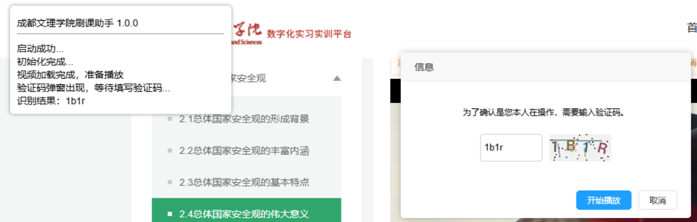

# cdcasSK

### 介绍

 [成都文理学院数字化实习实训平台](https://zxshixun.cdcas.com/)  & 仓辉教育科技 自动刷课

**启动时关闭系统代理，否则视频刷新不出来。**

仅在成都文理学院做了测试。 

本脚本改编自 [YoungLee-coder/MoocTool-CDCAS](https://github.com/YoungLee-coder/MoocTool-CDCAS) 刷课脚本。

自动识别填充网页验证码使用 [sw1128/Web_Captcha](https://github.com/sw1128/Web_Captcha) 的接口。

在原基础上，添加了用户交互界面、自动识别填充验证码等功能。

如上图，只会在课程学习页面运行，其他页面不会允许。